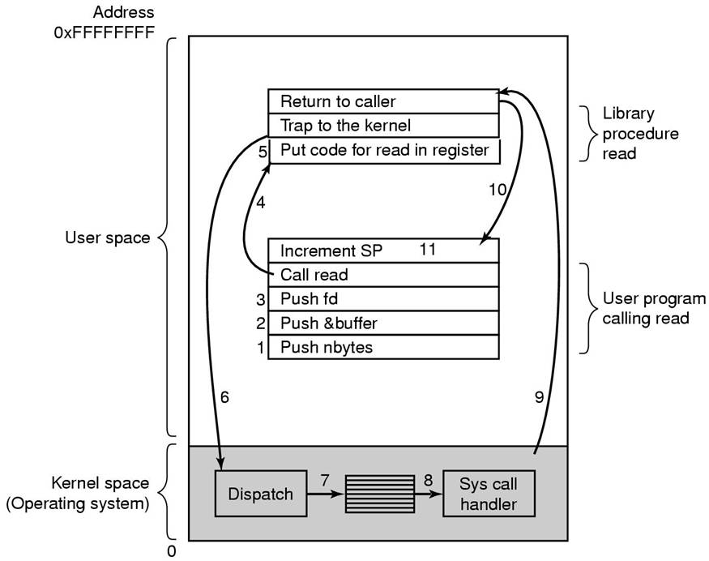
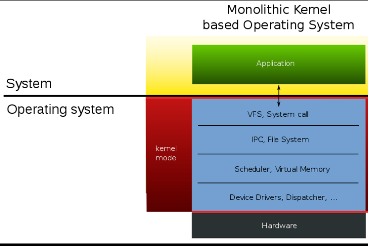
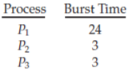
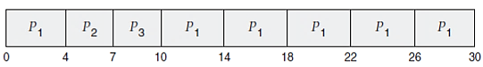

# Advanced Operating System

1. Write a short note on History of Operating System.
2. Write a short note on steps involve in making a system call.
3. Short note on Exokernal and client server model.
4. Short note on Monolithic System.
5. Write a short note on Scheduling. Explain
	*  Round robin.
	* Priority scheduling.
	* First-come, first-served.
	* Shortest job first.
6. Short note on process and thread. What is the fundamental difference
between a process and a thread?
7. Short note on process table.
8. Explain what is block device and character device. Distinguish between
them.

Answers.

## Write a short note on History of Operating System.
Answer 1)
 
There are a few generations of computers that have led to the modern day computing systems. I have tried to list them below in a comprehensive list describing what each generation did and what major changes it brought in the computing era.

1. **The First Generation (1940's to early 1950's)**
When electronic computers where first introduced in the 1940's they were created without any operating systems. All programming was done in absolute machine language, often by wiring up plugboards to control the machine's basic functions.During this generation computers were generally used to solve simple math calculations, operating systems were not necessarily needed.
2. **The Second Generation (1955-1965)**
The first operating system was introduced in the early 1950's, it was called GMOS and was created by General Motors for IBM's machine the 701. Operating systems in the 1950's were called single-stream batch processing systems because the data was submitted in groups. These new machines were called mainframes, and they were used by professional operators in large computer rooms. Since there was such as high price tag on these machines, only government agencies or large corporations were able to afford them.
3. **The Third Generation (1965-1980)**
By the late 1960's operating systems designers were able to develop the system of multiprogramming in which a computer program will be able to perform multiple jobs at the same time.The introduction of multiprogramming was a major part in the development of operating systems because it allowed a CPU to be busy nearly 100 percent of the time that it was in operation. Another major development during the third generation was the phenomenal growth of minicomputers, starting with the DEC PDP-1 in 1961. The PDP-1 had only 4K of 18-bit words, but at $120,000 per machine (less than 5 percent of the price of a 7094), it sold like hotcakes. These microcomputers help create a whole new industry and the development of more PDP's. These PDP's helped lead to the creation of personal computers which are created in the fourth generation.
4. **The Fourth Generation (1980-Present Day)**
The fourth generation of operating systems saw the creation of personal computing. Although these computers were very similar to the minicomputers developed in the third generation, personal computers cost a very small fraction of what minicomputers cost. A personal computer was so affordable that it made it possible for a single individual could be able to own one for personal use while minicomputers where still at such a high price that only corporations could afford to have them. One of the major factors in the creation of personal computing was the birth of Microsoft and the Windows operating system. The windows Operating System was created in 1975 when Paul Allen and Bill Gates had a vision to take personal computing to the next level. They introduced the MS-DOS in 1981 although it was effective it created much difficulty for people who tried to understand its cryptic commands. Windows went on to become the largest operating system used in techonology today with releases of Windows 95, Windows 98, WIndows XP (Which is currently the most used operating system to this day), and their newest operating system Windows 7. Along with Microsoft, Apple is the other major operating system created in the 1980's. Steve Jobs, co founder of Apple, created the Apple Macintosh which was a huge success due to the fact that it was so user friendly. Windows development throughout the later years were influenced by the Macintosh and it created a strong competition between the two companies. Today all of our electronic devices run off of operating systems, from our computers and smartphones, to ATM machines and motor vehicles. And as technology advances, so do operating systems.

 ## Write a short note on steps involve in making a system call.

Answer 2)

### 11 steps involved in making a system call

1. In steps 1-3, the calling program pushes the parameters onto the stack. The first and 	third parameters are called by value, but the second one is called by its address as 	denoted by the & symbol.
2. In step 4, the actual call to the library procedure is made. This instruction is the normal procedure call instruction used to call all procedures.
3. In step 5, the library procedure places the system call number in a place where the operating system expects it, such as a register.
4. In step 6, the library procedure executes a TRAP instruction to switch from user mode to kernel mode and start execution at a fixed address within the kernel.
5. In step 7, the kernel examines the system call number and then dispatches it to the correct system call handler. This correct number is given in the table of system call handlers by pointers referenced at the system call number.
6. In step 8, the system call handler runs.
7. In step 9, the operation is completed, and the user is given back control once the TRAP instruction is set.
8. In step 10, this procedure returns to the user program, like how all normal library procedures do.
9. In step 11, the operating system has to clear the stack, so it increments it enough so that it is empty.

## Short note on Exokernal and client server model.

Answer)

Exokernel is an operating system kernel developed by the MIT Parallel and 
Distributed Operating Systems group, and also a class of similar operating systems.

Operating systems generally present hardware resources to applications through 
high-level abstractions such as (virtual) file systems. The idea behind 
exokernels is to force as few abstractions as possible on application developers, 
enabling them to make as many decisions as possible about hardware abstractions. 
Exokernels are tiny, since functionality is limited to ensuring protection and 
multiplexing of resources, which is considerably simpler than conventional 
microkernels' implementation of message passing and monolithic kernels' 
implementation of high-level abstractions.

Implemented applications are called library operating systems; they may request 
specific memory addresses, disk blocks, etc. The kernel only ensures that the 
requested resource is free, and the application is allowed to access it. This 
low-level hardware access allows the programmer to implement custom abstractions, 
and omit unnecessary ones, most commonly to improve a program's performance. 
It also allows programmers to choose what level of abstraction they want, 
high, or low.

Exokernels can be seen as an application of the end-to-end principle to operating
systems, in that they do not force an application program to layer its
abstractions on top of other abstractions that were designed with different 
requirements in mind. For example, in the MIT Exokernel project, the Cheetah 
web server stores preformatted Internet Protocol packets on the disk, the kernel 
provides safe access to the disk by preventing unauthorized reading and writing, 
but how the disk is abstracted is up to the application or the libraries the application uses.

### Client / Server Architecture

1.	The client–server relationship is common with networked machines. 
2.	Remote file systems allow a computer to mount one or more file systems from one or more remote machines. 
3.	In this case, the machine containing the files is the server, and the machine seeking access to the files is the client. 
4.	Generally, the server declares that a resource is available to clients and specifies exactly which resource (in this case, which files) and exactly which clients.
5.	A server can serve multiple clients, and a client can use multiple servers, depending on the implementation details of a given client–server facility. 
6.	The server usually specifies the available files on a volume or directory level. 
7.	Client identification is more difficult. 
8.	A client can be specified by a network name or other identifier, such as an IP address, but these can be spoofed, or imitated. As a result of spoofing, an unauthorized client could be allowed access to the server. 
9.	More secure solutions include secure authentication of the client via encrypted keys. Unfortunately, with security come many challenges, including ensuring compatibility of the client and server (they must use the same encryption algorithms) and security of key exchanges (intercepted keys could again allow unauthorized access).

## What is Monolithic System

A monolithic kernel is an operating system architecture where the entire 
operating system is working in kernel space. The monolithic model differs from 
other operating system architectures (such as the microkernel architecture) 
in that it alone defines a high-level virtual interface over computer hardware. 
A set of primitives or system calls implement all operating system services such 
as process management, concurrency, and memory management. Device drivers can be 
added to the kernel as modules.

A monolithic architecture is the traditional unified model for the design of a software program.

monolithic, in this context, means composed all in one piece. Monolithic 
software is designed to be self-contained; components of the program are 
interconnected and interdependent rather than loosely coupled as is the case 
with modular software programs. In a tightly-coupled architecture, each 
component and its associated components must be present in order for code to be 
executed or compiled.

## Write a short note on Scheduling. Explain
* Round robin.
* Priority scheduling.
* First-come, first-served.
* Shortest job first.

* Round Robin
  1.	The round-robin (RR) scheduling algorithm is designed especially for timesharing systems.
  2.	It is similar to FCFS scheduling, but preemption is added to enable the system to switch between processes.
  3.	A small unit of time, called a time quantum or time slice, is defined.
  4.	A time quantum is generally from 10 to 100 milliseconds in length. The ready queue is treated as a circular queue.
  5.	The CPU scheduler goes around the ready queue, allocating the CPU to each process for a time interval of up to 1 time quantum.
  6.	To implement RR scheduling, we again treat the ready queue as a FIFO queue of processes. 
  7.	New processes are added to the tail of the ready queue.
  8.	The CPU scheduler picks the first process from the ready queue, sets a timer to interrupt after 1 time quantum, and dispatches the process.
  9. One of two things will then happen:
     1. The process may have a CPU burst of less than 1 time quantum: In this case, the process itself will release the CPU voluntarily. The scheduler will then proceed to the next process in the ready queue. 
     2. If the CPU burst of the currently running process is longer than 1 time quantum, the timer will go off and will cause an interrupt to the operating system: A context switch will be executed, and the process will be put at the tail of the ready queue. 
     3. The CPU scheduler will then select the next process in the ready queue.
  10. The average waiting time under the RR policy is often long. 
  11. Consider the following set of processes that arrive at time 0, with the length of the CPU burst given in milliseconds:
   
   

	1. If we use a time quantum of 4 milliseconds, then process P1 gets the first 4 milliseconds. 
	2. Since it requires another 20 milliseconds, it is preempted after the first time quantum, and the CPU is given to the next process in the queue, process P2. 
	3. Process P2 does not need 4 milliseconds, so it quits before its time quantum expires. 
	4. The CPU is then given to the next process, process P3. 
	5. Once each process has received 1 time quantum, the CPU is returned to process P1 for an additional time quantum. 
	6. The resulting RR schedule is as follows:
   
   
