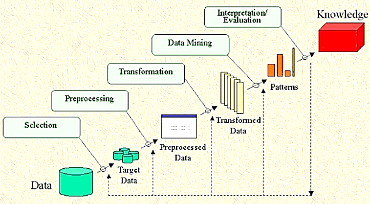

# Business Intelligence and Big Data Analytics
1. Discuss the uses and benefits of Business Intelligence.
2. With the help of a diagram explain the KDD process mode.
3. Explain the different types of binning giving suitable examples.
4. Explain the following terms: Missing Values; Noisy Values; Inconsistent
values; redundant values; Outliers
5. With the help of a diagram explain the Data-Information-KnowledgeDecision making-Action cycle.
6. Explain the following terms with respect to Association Analysis: Support;
Confidence; Lift; Conviction
7. Explain the Apriori Algorithm using a appropriate algorithm.
8. Discuss the issues with Apriori Algorithm.

Answers.

## Discuss the uses and benefits of Business Intelligence.

Business intelligence (BI) combines business analytics, data mining, data 
visualization, data tools and infrastructure, and best practices to help 
organizations to make more data-driven decisions. In practice, you know you’ve 
got modern business intelligence when you have a comprehensive view of your 
organization’s data and use that data to drive change, eliminate inefficiencies, 
and quickly adapt to market or supply changes.

Business intelligence is rather an umbrella term that covers the processes and 
methods of collecting, storing, and analyzing data from business operations or 
activities to optimize performance. All of these things come together to create 
a comprehensive view of a business to help people make better, actionable decisions.

Over the past few years, business intelligence has evolved to include more 
processes and activities to help improve performance. These processes include:

* Data mining: 
  Using databases, statistics and machine learning to uncover trends
  in large datasets.
* Reporting: 
  Sharing data analysis to stakeholders so they can draw conclusions and make decisions.
* Performance metrics and benchmarking: 
  Comparing current performance data to historical data to track performance against goals, typically using customized dashboards.
* Descriptive analytics: 
  Using preliminary data analysis to find out what happened.
* Querying: 
  Asking the data specific questions, BI pulling the answers from the datasets.
* Statistical analysis: 
  Taking the results from descriptive analytics and further exploring the data using statistics such as how this trend happened and why.
* Data visualization: 
  Turning data analysis into visual representations such as charts, graphs, and histograms to more easily consume data.
* Visual analysis: 
  Exploring data through visual storytelling to communicate insights on the fly and stay in the flow of analysis.
* Data preparation: 
  Compiling multiple data sources, identifying the dimensions and measurements, preparing it for data analysis.

  Uses and Benefits of BI:-

  * Fast and accurate reporting: 
    1. Employees can use templates or customized reports to monitor KPIs using a variety of data sources, including financial, operations, and sales data. 
    2. These reports are  generated in real time and use the most relevant data so businesses can act quickly. 
    3. Most reports include easy to read visualizations, such as graphs, tables, and charts. 
    4. Some BI software reports are interactive so that users can play with different variables or access information even faster.
  * Valuable business insights: 
	1. Businesses can gauge employee productivity, revenue, overall success as well as department-specific performances. 
    2. It can uncover strengths and weaknesses since BI tools help organizations understand what’s working and what isn’t. 
    3. Setting up alerts is easy and can help track these metrics and help busy executives stay on top of the KPIs that matter the most to their business.
  * Competitive analysis: 
    1. The ability to manage and manipulate a large amount of data is a competitive edge in itself. 
    2. Furthermore, budgeting, planning, and forecasting is an incredibly powerful way to stay ahead of the competition, goes way beyond standard analysis, and is also easy to perform with BI software. 
    3. Businesses can also track their competitor’s sales and marketing performance and learn how to differentiate products and services.
  * Better data quality: 
    1. Data is rarely squeaky clean and there are many ways that  discrepancies and inaccuracies can show up – especially with a hacked together “database”. 
    2. Businesses that take care of collecting, updating and creating quality data are typically more successful. 
    3. With BI software, companies can aggregate different data sources for a fuller picture of what is happening with their business.

  * Waste can be defined as anything that is not adding value to a company. Business intelligence systems can pinpoint areas of waste that might have gone previously unnoticed in most companies. More unnoticed waste means less productivity.

  * Running your business shouldn’t be like running in the dark. Business intelligence solutions can help you make informed decisions rather than “going with your gut.” Detailed and up-to-date data can help your company succeed in knowing the best strategy – not guessing.

  * Whether you are in the office or on the go, you can get quick and easy access to metrics reports for your company. This allows you to be more productive on the road while also saving you the time and effort of searching through endless amounts of files.

  * Business Iintellignece systems allow you to identify up-to-date reports on market trends, product development, and customer preferences. When you have that information at your fingertips, your sales team can work more efficiently and more productively, consequently improving your bottom line.

  * With business intelligence software you can order the right level of inventory at any given time and ensure that customers get their products when they need them. With this, you can eliminate wasted inventory expenses and do more to improve your business.

  * By automating data collection and report generation, you are able to reduce employee training and development costs. Business Intelligence can also reduce costs by allowing you to understand how well you’re performing with a certain number of employees and how many you need to reach your goals.

  * Implementing a business intelligence system can allow you to gain insight into markets, competitors, and your own performance. That information can be key in getting ahead of competitors on customer preferences and market trends.

## With the help of a diagram explain the KDD process mode.

Knowledge discovery in databases (KDD) is the process of discovering useful knowledge 
from a collection of data. This widely used data mining technique is a process 
that includes data preparation and selection, data cleansing, incorporating prior 
knowledge on data sets and interpreting accurate solutions from the observed 
results.

Major KDD application areas include marketing, fraud detection, telecommunication 
and manufacturing.

Steps involved in the entire KDD process are:

1. Identify the goal of the KDD process from the customer’s perspective
2. Understand application domains involved and the knowledge that's required
3. Select a target data set or subset of data samples on which discovery is be performed.
4. Cleanse and preprocess data by deciding strategies to handle missing fields and alter the data as per the requirements.
5. Simplify the data sets by removing unwanted variables. Then, analyze useful features that can be used to represent the data, depending on the goal or task.
6. Match KDD goals with data mining methods to suggest hidden patterns.
7. Choose data mining algorithms to discover hidden patterns. This process includes deciding which models and parameters might be appropriate for the overall KDD process.
8. Search for patterns of interest in a particular representational form, which include classification rules or trees, regression and clustering
9. Interpret essential knowledge from the mined patterns.
10. Use the knowledge and incorporate it into another system for further action.
11. Document it and make reports for interested parties.

## Explain the different types of binning giving suitable examples.

