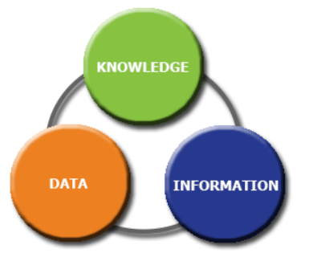
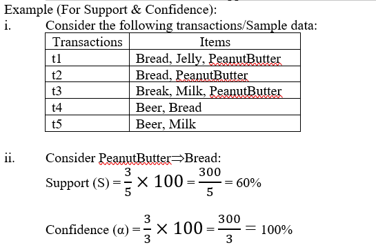
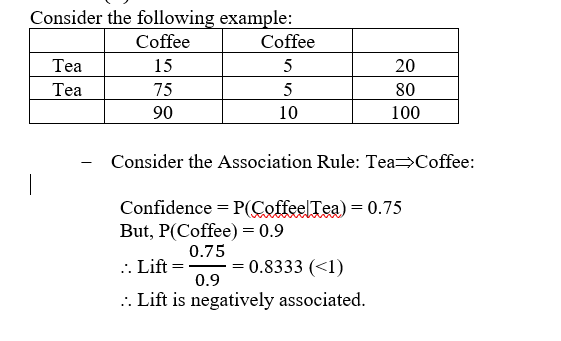
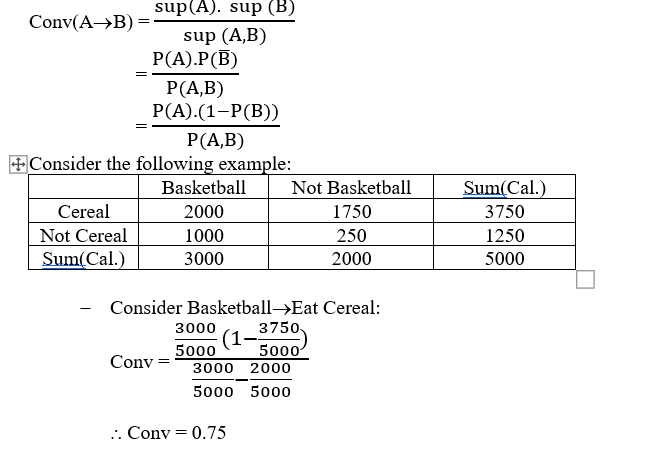
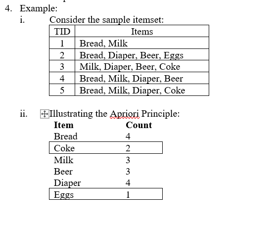
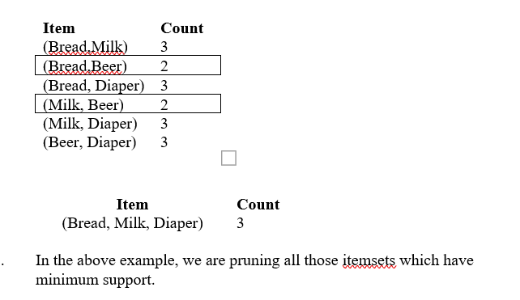

# Business Intelligence and Big Data Analytics
1. Discuss the uses and benefits of Business Intelligence.
2. With the help of a diagram explain the KDD process mode.
3. Explain the different types of binning giving suitable examples.
4. Explain the following terms: Missing Values; Noisy Values; Inconsistent
values; redundant values; Outliers
5. With the help of a diagram explain the Data-Information-KnowledgeDecision making-Action cycle.
6. Explain the following terms with respect to Association Analysis: Support;
Confidence; Lift; Conviction
7. Explain the Apriori Algorithm using a appropriate algorithm.
8. Discuss the issues with Apriori Algorithm.

Answers.

## Discuss the uses and benefits of Business Intelligence.

Business intelligence (BI) combines business analytics, data mining, data 
visualization, data tools and infrastructure, and best practices to help 
organizations to make more data-driven decisions. In practice, you know you’ve 
got modern business intelligence when you have a comprehensive view of your 
organization’s data and use that data to drive change, eliminate inefficiencies, 
and quickly adapt to market or supply changes.

Business intelligence is rather an umbrella term that covers the processes and 
methods of collecting, storing, and analyzing data from business operations or 
activities to optimize performance. All of these things come together to create 
a comprehensive view of a business to help people make better, actionable decisions.

Over the past few years, business intelligence has evolved to include more 
processes and activities to help improve performance. These processes include:

* Data mining: 
  Using databases, statistics and machine learning to uncover trends
  in large datasets.
* Reporting: 
  Sharing data analysis to stakeholders so they can draw conclusions and make decisions.
* Performance metrics and benchmarking: 
  Comparing current performance data to historical data to track performance against goals, typically using customized dashboards.
* Descriptive analytics: 
  Using preliminary data analysis to find out what happened.
* Querying: 
  Asking the data specific questions, BI pulling the answers from the datasets.
* Statistical analysis: 
  Taking the results from descriptive analytics and further exploring the data using statistics such as how this trend happened and why.
* Data visualization: 
  Turning data analysis into visual representations such as charts, graphs, and histograms to more easily consume data.
* Visual analysis: 
  Exploring data through visual storytelling to communicate insights on the fly and stay in the flow of analysis.
* Data preparation: 
  Compiling multiple data sources, identifying the dimensions and measurements, preparing it for data analysis.

  Uses and Benefits of BI:-

  * Fast and accurate reporting: 
    1. Employees can use templates or customized reports to monitor KPIs using a variety of data sources, including financial, operations, and sales data. 
    2. These reports are  generated in real time and use the most relevant data so businesses can act quickly. 
    3. Most reports include easy to read visualizations, such as graphs, tables, and charts. 
    4. Some BI software reports are interactive so that users can play with different variables or access information even faster.
  * Valuable business insights: 
	1. Businesses can gauge employee productivity, revenue, overall success as well as department-specific performances. 
    2. It can uncover strengths and weaknesses since BI tools help organizations understand what’s working and what isn’t. 
    3. Setting up alerts is easy and can help track these metrics and help busy executives stay on top of the KPIs that matter the most to their business.
  * Competitive analysis: 
    1. The ability to manage and manipulate a large amount of data is a competitive edge in itself. 
    2. Furthermore, budgeting, planning, and forecasting is an incredibly powerful way to stay ahead of the competition, goes way beyond standard analysis, and is also easy to perform with BI software. 
    3. Businesses can also track their competitor’s sales and marketing performance and learn how to differentiate products and services.
  * Better data quality: 
    1. Data is rarely squeaky clean and there are many ways that  discrepancies and inaccuracies can show up – especially with a hacked together “database”. 
    2. Businesses that take care of collecting, updating and creating quality data are typically more successful. 
    3. With BI software, companies can aggregate different data sources for a fuller picture of what is happening with their business.

  * Waste can be defined as anything that is not adding value to a company. Business intelligence systems can pinpoint areas of waste that might have gone previously unnoticed in most companies. More unnoticed waste means less productivity.

  * Running your business shouldn’t be like running in the dark. Business intelligence solutions can help you make informed decisions rather than “going with your gut.” Detailed and up-to-date data can help your company succeed in knowing the best strategy – not guessing.

  * Whether you are in the office or on the go, you can get quick and easy access to metrics reports for your company. This allows you to be more productive on the road while also saving you the time and effort of searching through endless amounts of files.

  * Business Iintellignece systems allow you to identify up-to-date reports on market trends, product development, and customer preferences. When you have that information at your fingertips, your sales team can work more efficiently and more productively, consequently improving your bottom line.

  * With business intelligence software you can order the right level of inventory at any given time and ensure that customers get their products when they need them. With this, you can eliminate wasted inventory expenses and do more to improve your business.

  * By automating data collection and report generation, you are able to reduce employee training and development costs. Business Intelligence can also reduce costs by allowing you to understand how well you’re performing with a certain number of employees and how many you need to reach your goals.

  * Implementing a business intelligence system can allow you to gain insight into markets, competitors, and your own performance. That information can be key in getting ahead of competitors on customer preferences and market trends.

## With the help of a diagram explain the KDD process mode.

Knowledge discovery in databases (KDD) is the process of discovering useful knowledge 
from a collection of data. This widely used data mining technique is a process 
that includes data preparation and selection, data cleansing, incorporating prior 
knowledge on data sets and interpreting accurate solutions from the observed 
results.

Major KDD application areas include marketing, fraud detection, telecommunication 
and manufacturing.

Steps involved in the entire KDD process are:

1. Identify the goal of the KDD process from the customer’s perspective
2. Understand application domains involved and the knowledge that's required
3. Select a target data set or subset of data samples on which discovery is be performed.
4. Cleanse and preprocess data by deciding strategies to handle missing fields and alter the data as per the requirements.
5. Simplify the data sets by removing unwanted variables. Then, analyze useful features that can be used to represent the data, depending on the goal or task.
6. Match KDD goals with data mining methods to suggest hidden patterns.
7. Choose data mining algorithms to discover hidden patterns. This process includes deciding which models and parameters might be appropriate for the overall KDD process.
8. Search for patterns of interest in a particular representational form, which include classification rules or trees, regression and clustering
9. Interpret essential knowledge from the mined patterns.
10. Use the knowledge and incorporate it into another system for further action.
11. Document it and make reports for interested parties.

## Explain the different types of binning giving suitable examples.

Data binning, bucketing is a data pre-processing method used to minimize the effects of small observation errors. The original data values are divided into small intervals known as bins and then they are replaced by a general value calculated for that bin. This has a smoothing effect on the input data and may also reduce the chances of overfitting in case of small datasets

1.	Real-world data tend to be noisy. 
2.	Noisy data is data with a large amount of additional meaningless information in it called noise. 
3.	Data cleaning (or data cleansing) routines attempt to smooth out noise while identifying outliers in the data.
4.	Binning or discretization is the process of transforming numerical variables into categorical counterparts.
5.	Data binning, bucketing is a data pre-processing method used to minimize the effects of small observation errors. 
6.	The original data values are divided into small intervals known as bins and then they are replaced by a general value calculated for that bin. 
7.	This has a smoothing effect on the input data and may also reduce the chances of overfitting in case of small datasets.
8.	Binning methods smooth a sorted data value by consulting its “neighborhood”, that is, the values around it.
9.	Binning means to sort data and partition into (equi-size) bins.
10.	There are 2 types of Binning methods: 
   * Equal Frequency (or Depth) Binning
     1. Bins have equal frequency.
     2. The algorithm divides the data into k groups which each group contains approximately same number of values. For both the methods, the best way of determining k is by looking at the histogram & try different intervals or groups.
     3. Example:
        Input: 
        
        [5, 10, 11, 13, 15, 35, 50, 55, 72, 92, 204, 215] 
        
        
        Output :

        [5, 10, 11, 13]

        [15, 35, 50, 55]

        [72, 92, 204, 215]

   * Equal Width Binning.
        1.	Bins have equal width with a range of each bin are defined as [min + w], [min + 2w] …. [min + nw] where w = (max – min) / (no of bins).
        
        Example:
        
        Input: 
        
        [5, 10, 11, 13, 15, 35, 50, 55, 72, 92, 204, 215]

        Output :
        
        [10, 11, 13, 15, 35, 50, 55, 72]

        [92]

        [204]

##  Explain the following terms: Missing Values; Noisy Values; Inconsistent values; redundant values; Outliers

1. Missing Values

   Missing data, or missing values, occur when no data value is stored for the variable in an observation. Missing data are a common occurrence and can have a significant effect on the conclusions that can be drawn from the data.

    Missing data can occur because of nonresponse: no information is provided for one or more items or for a whole unit ("subject"). Some items are more likely to generate a nonresponse than others: for example items about private subjects such as income. Attrition is a type of missingness that can occur in longitudinal studies—for instance studying development where a measurement is repeated after a certain period of time. Missingness occurs when participants drop out before the test ends and one or more measurements are missing.
2. Noisy Values

    Noisy data is data with a large amount of additional meaningless information in it called noise. This includes data corruption and the term is often used as a synonym for corrupt data. It also includes any data that a user system cannot understand and interpret correctly. Many systems, for example, cannot use unstructured text. Noisy data can adversely affect the results of any data analysis and skew conclusions if not handled properly. Statistical analysis is sometimes used to weed the noise out of noisy data.

3. Inconsistent Values
    1. containing discrepancies in codes or names
    2.	e.g., Age=“42” Birthday=“03/07/1997” 
    3.	e.g., Was rating “1,2,3”, now rating “A, B, C”
    4.	e.g., discrepancy between duplicate records

4. Reduntant Values 
    
    Data redundancy are those values which are repeated unnecessarily in one or more records or fields, within a table, or where the field is replicated/repeated in two or more tables.
5. Outliers

   Outlier data is data that appears to not belong in the data set. It can be caused by human error such as transposing numerals, mislabeling, programming bugs, etc. If actual outliers are not removed from the data set, they corrupt the results to a small or large degree depending on circumstances. If valid data is identified as an outlier and is mistakenly removed, that also corrupts results.

## With the help of a diagram explain the Data-Information-Knowledge Decision making-Action cycle.

1.	Data management is a very lexically challenged discipline. 
2.	A major part of that lexical challenge is the terms data, information, and knowledge.
3.	Data:
    1. They are individual facts that have meaning and can be readily understood.
    2. They are the raw facts wrapped with meaning, but they are not yet information. 
    3. Datum in context is a single fact wrapped with meaning.
4. Information:
    1. It is a set of data in context with relevance to one or more people at a point in time or for a period of time. 
    2. Information is more than data in context—it must have relevance and a time frame.  
    3. Information is considered to be singular.
5. Knowledge:
    1.	It is cognizance, cognition, the fact or condition of knowing something with familiarity gained through experience or association. 
    2.	It’s the acquaintance with or the understanding of something, the fact or condition of being aware of something, or apprehending truth or fact.  
    3.	Knowledge is information that has been retained with an understanding about the significance of that information.
    4.	Knowledge includes something gained by experience, study, familiarity, association, awareness, and/or comprehension.

## Explain the following terms with respect to Association Analysis: Support; Confidence; Lift; Conviction

1.	Support:

    * The Support (S) for an association rule (XY) is the percentage of the transactions in the database that contain XY.
    * Fraction of transactions that contain both X & Y.
2.	Confidence:
    * The Confidence or Strength (α) for an association rule XY is the ratio of the number of transactions that contain XY to the number of transactions that contain X.
    * It measures the strength of the rule.
    * Measures how often items in Y appear in transactions that contain X.

    

3. Lift 
    * It is one of the measures that is taken into account for statistical dependence.
	* Lift = (P(Y|X))/(P(Y))

    
4. Conviction:
   * Conviction is a measure of implication & has a value of 1 if items are unrelated.

    

## Explain Apriori Algorithm using a appropriate example.

Apriori is an algorithm for frequent item set mining and association rule 
learning over relational databases. It proceeds by identifying the frequent 
individual items in the database and extending them to larger and larger item 
sets as long as those item sets appear sufficiently often in the database. The 
frequent item sets determined by Apriori can be used to determine association 
rules which highlight general trends in the database: this has applications in 
domains such as market basket analysis.

1.	Let k-1
2.	Generate frequent itemsets of length 1.
3.	Repeat until no new frequent itemsets are identified.
    1.	Generate length (k+1) candidate from length k frequent itemsets.
    2. Prune candidate itemsets containing subsets of length k that are infrequent.
    3. Eliminate candidates that are infrequent, leaving only those which are frequent.

    
    

## 8.	Discuss the issues with Apriori Algorithm.
Ans.:
1.	The major drawback with Apriori algorithm is of time and space.
2.	A key concept in Apriori algorithm is the anti-monotonicity of the support measure. It assumes that:
i.	All subsets of a frequent itemset must be frequent
ii.	Similarly, for any infrequent itemset, all its supersets must be infrequent too.
3.	The execution time is more as wasted in producing candidates everytime, it also needs more search space and computational cost is too high.   
4.	It generates numerous uninteresting itemsets which lead to generate various rules which are of completely of no use. 
5.	The two factors considered for association rules generation are Minimum Support Threshold and Minimum Confidence Threshold.
6.	Apriori Algorithm can be slow as it requires many database scans.
7.	The main limitation is time required to hold a vast number of candidate sets with much frequent itemsets, low minimum support or large itemsets i.e. it is not an efficient approach for large number of datasets.
8.	For example, if there are 10^4 from frequent 1- itemsets, it need to generate more than 10^7 candidates into 2-length which in turn they will be tested and accumulate. 
9.	Furthermore, to detect frequent pattern in size 100 i.e. v1, v2… v100, it have to generate 2^100 candidate itemsets that yield on costly and wasting of time of candidate generation. 
10.	So, it will check for many sets from candidate itemsets, also it will scan database many times repeatedly for finding candidate itemsets. 
11.	Apriori will be very low and inefficiency when memory capacity is limited with large number of transactions.
12.	It assumes that the transaction database is memory resident.
