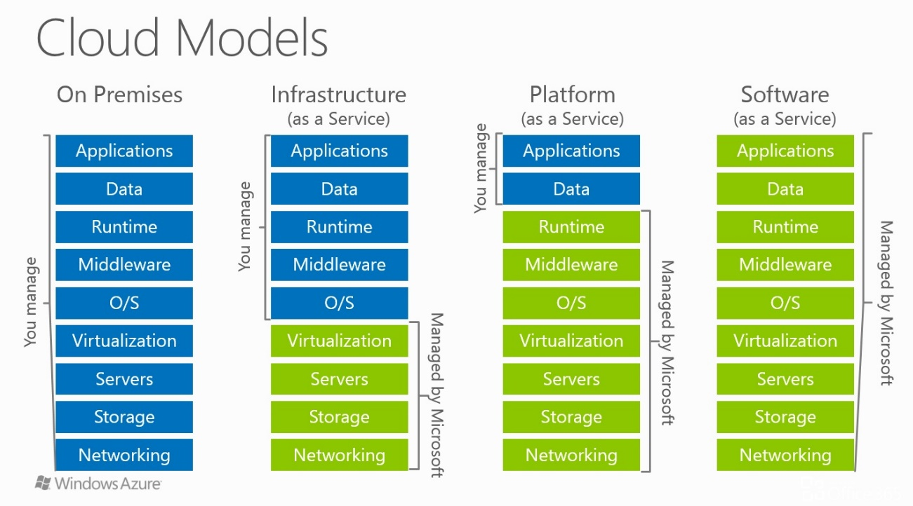
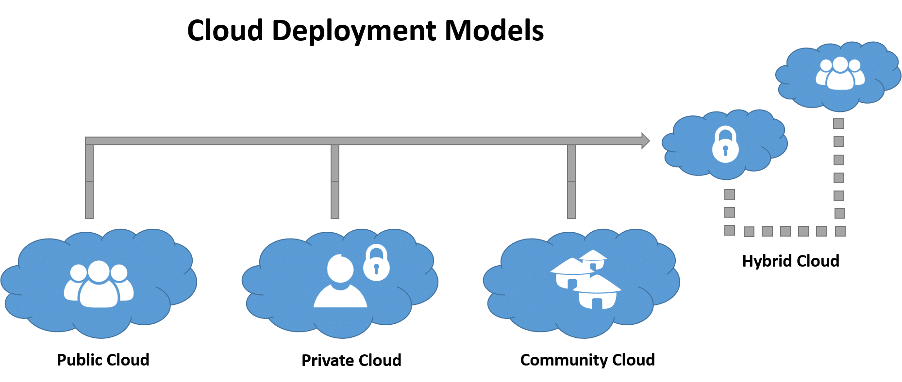
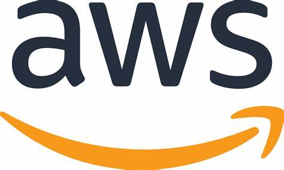
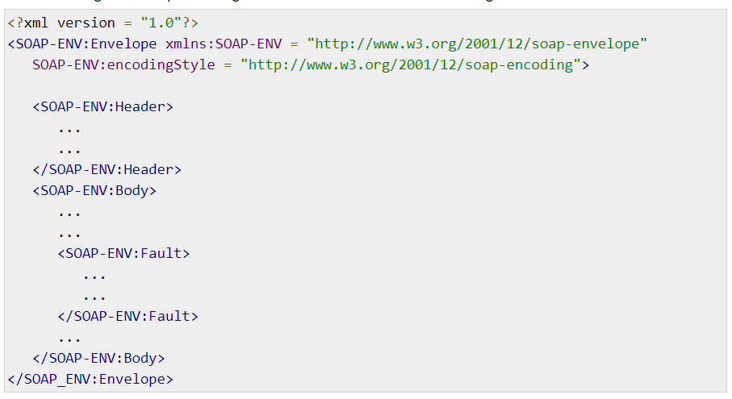
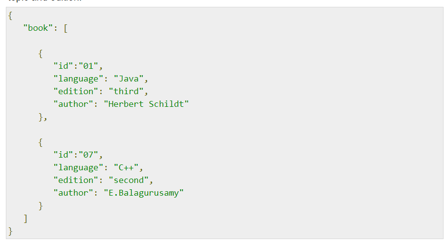

# Cloud Computing

1. Explain the concept of Product versus Service in detail.
2. Explain the various cloud computing services.
3. Explain Deployment model in Cloud.
4. What is AWS? Explain in detail.
5. Write about Disk Operating System.
6. Explain Component Object Model
7. Write a short note on Web Services.
8. Explain HTTP Request – Response methods.
9. Explain Web Services Data Format SOAP & JSON
10. Explain the difference between the Document style and RPC style

Answers -

## Explain the concept of Product versus Service in detail.

Product - 
---

Anything that you can hold, see or feel is a product. So, whether you are buying 
your groceries or wine or car, you are buying products that you can use and consume 
or resell afterwards. Products such as vegetables and other eatables get consumed 
by us whereas we make use of other types of goods for a longer time. We buy 
clothes, shoes, electronics, and even houses and cars that are all seen as 
products as they can be seen and used.

The word product comes from the verb produce that tells us that a product is 
a result of a manufacturing process or labor. However, natural things also 
come under the category of products such as wood, gas, flowers (read bouquet), 
fruits, vegetables etc. In the manufacturing sector, raw materials required to 
make a finished product is referred to as product.

Service - 
---

When we are building a home for ourselves, we need specialists like a plumber, 
an electrician, air conditioning experts and all sorts of other professionals to 
ensure comfort and conveniences for our family members. These specialists provide 
services to us for which they charge money from us. Once the home has been built, 
you require the services of not just an insurance agent but also the services of 
security equipment providers. Even, before you think of building a home, you 
need money which is provided by a bank through its loan services. The 
construction of the house is not possible without hiring the services of 
architects, engineers and builders all of whom charge for their expertise.

However, service is not always so clearly demarcated and often it is intertwined 
with a product as when you buy a mobile but are dependent upon the services 
provided by the carrier. Even in case of landline, you can at best buy an 
apparatus, but it works only because of the service provided by the company. 
You buy a car, but you need the service to maintain it; also, the service from 
gas stations to keep it running. Even the products that we buy from the market 
are backed by after sale service of the companies.

Difference between them
---

* Products are tangible, and you can see, hold and own them while the service is intangible and can only be experienced.

* Products can be stored and used whereas it is not possible to store a service.

* You can buy a shutter from the market but need the service of an expert to get it installed and also for its maintenance.

* You can buy a car (product) but depend upon gas stations (service), garage (service), and insurance agents (service) for its upkeep and maintenance.

* Products can be counted whereas service can be compared or described as better or worse.

## Explain the various cloud computing services.

IaaS, PaaS and SaaS are cloud computing service models.

IaaS (Infrastructure as a Service), as the name suggests, provides you the 
computing infrastructure, physical or (quite often) virtual machines and other 
resources like virtual-machine disk image library, block and file-based storage, 
firewalls, load balancers, IP addresses, virtual local area networks etc.

Examples: Amazon EC2, Windows Azure, Rackspace, Google Compute Engine.

PaaS (Platform as a Service), as the name suggests, provides you computing 
platforms which typically includes operating system, programming language 
execution environment, database, web server etc.

Examples: AWS Elastic Beanstalk, Windows Azure, Heroku, Force.com, Google 
App Engine, Apache Stratos.

While in SaaS (Software as a Service) model you are provided with access to 
application software often referred to as "on-demand software". You don't 
have to worry about the installation, setup and running of the application. 
Service provider will do that for you. You just have to pay and use it through 
some client.

Examples: Google Apps, Microsoft Office 365.

Few additional points regarding your question:

AWS (Amazon web services) is a complete suite which involves a whole bunch of useful web services. Most popular are EC2 and S3 and they belong to IaaS service model.

Although Hadoop is based on previous works by Google(GFS and MapReduce), it is not from Google. It is an Apache project. You can find more here. It is just a distributed computing platform and does not fall into any of these service models, IMHO.

Microsoft's Windows Azure is again an example of IaaS.

As far as popularity of these services is concerned, they all are popular. It's 
just that which one fits into your requirements better. For example, if you want 
to have a Hadoop cluster on which you would run MapReduce jobs, you will find 
EC2 a perfect fit, which is IaaS. On the other hand if you have some application, 
written in some language, and you want to deploy it over the cloud, you would 
choose something like Heroku, which is an example of PaaS.

## Explain Deployment model in Cloud.

There are 3 different types of deployment models in Cloud.

* Public Cloud -
  
  Public clouds are the most common way of deploying cloud computing. The cloud 
  resources (like servers and storage) are owned and operated by a third-party 
  cloud service provider and delivered over the Internet. Microsoft Azure is an 
  example of a public cloud. With a public cloud, all hardware, software, and 
  other supporting infrastructure is owned and managed by the cloud provider. 
  In a public cloud, you share the same hardware, storage, and network devices 
  with other organizations or cloud “tenants.” You access services and manage 
  your account using a web browser. Public cloud deployments are frequently used 
  to provide web-based email, online office applications, storage, and testing 
  and development environments.
  
  Advantages of public clouds:
  
  * Lower costs—no need to purchase hardware or software, and you pay only for the service you use.
  * No maintenance—your service provider provides the maintenance.
  * Near-unlimited scalability—on-demand resources are available to meet your business needs.
  * High reliability—a vast network of servers ensures against failure.

* Private Cloud - 
  
  A private cloud consists of computing resources used exclusively by one 
  business or organization. The private cloud can be physically located at your 
  organization’s on-site datacenter, or it can be hosted by a third-party service 
  provider. But in a private cloud, the services and infrastructure are 
  always maintained on a private network and the hardware and software are 
  dedicated solely to your organization. In this way, a private cloud can 
  make it easier for an organization to customize its resources to meet 
  specific IT requirements. Private clouds are often used by government agencies, 
  financial institutions, any other mid- to large-size organizations with 
  business-critical operations seeking enhanced control over their environment.

  Advantages of a private clouds:

  * More flexibility—your organization can customize its cloud environment to meet specific business needs.
  * Improved security—resources are not shared with others, so higher levels of control and security are possible.
  * High scalability—private clouds still afford the scalability and efficiency of a public cloud.

* Hybrid Cloud - 
  
  Often called “the best of both worlds,” hybrid clouds combine on-premises 
  infrastructure, or private clouds, with public clouds so organizations can 
  reap the advantages of both. In a hybrid cloud, data and applications can 
  move between private and public clouds for greater flexibility and more 
  deployment options. For instance, you can use the public cloud for high-volume, 
  lower-security needs such as web-based email, and the private cloud (or other 
  on-premises infrastructure) for sensitive, business-critical operations 
  like financial reporting. In a hybrid cloud, “cloud bursting” is also an 
  option. This is when an application or resource runs in the private cloud 
  until there is a spike in demand (such as seasonal event like online shopping 
  or tax filing), at which point the organization can “burst through” to the 
  public cloud to tap into additional computing resources.

  Advantages of hybrid clouds:

  * Control—your organization can maintain a private infrastructure for sensitive assets.
  * Flexibility—you can take advantage of additional resources in the public cloud when you need them.
  * Cost-effectiveness—with the ability to scale to the public cloud, you pay for extra computing power only when needed.
  * Ease—transitioning to the cloud doesn’t have to be overwhelming because you can migrate gradually—phasing in workloads over time.

## What is AWS? Explain in detail.

1.	Amazon Web Services (AWS) is a global platform with data centers around the globe.
2.	Amazon describes cloud computing as “the on-demand delivery of IT resources via the Internet with pay-as-you-go pricing”
3.	Cloud computing is about leasing servers and storage from a provider like Amazon.
4.	The cloud offers information technology workers significant cost savings and unimaginable agility.
5.	Tasks that traditionally took weeks of work, costing thousands of dollars, can be completed in minutes for fractions of a penny.
6.	In addition, cloud computing offers inconceivable scalability.
7.	With a single line of code, you can provision thousands of servers.
8.	Most important, you pay only for what you need and give the equipment back when you’re done.
9.	Furthermore, because you are paying by the hour, running one server for a thousand hours costs the same amount as running a thousand servers for one hour.
10.	Finally, cloud computing is often used in concert with automation. When we combine scalability with automation, we have the ability to build an application that responds to load.
11.	A self-healing web application that automatically reconfigures itself in response to changes in load.
12.	AWS is organized into multiple regions around the globe.
13.	Each region is designed to be independent of the others.
14.	This isolation allows us to design highly available applications that span the globe and ensure low-latency response times to our users
15.	There are currently nine regions around the world belonging to AWS.
16.	By selecting a region closest to your users, you can deliver the best experience by minimizing latency.

## Write about Disk Operating System.

1.	Initially there was no windows os, no mouse. 
2.	It was text based operating system.
3.	All commands or options had to be typed.
4.	It is the command line-prompt that we see today in modern computer system. 
5.	You would give text based commands, run these commands as a batch in a file. The input device was Floppy Disk. 
6.	You had the internet but it did not have the browser as yet.
7.	Programs would be written in C and then the compilers would convert them into an executable. 
8.	There would be one .exe file. But then it was difficult to call or reuse a function with an .exe file.
9.	This executable was the binary version of the code that you wrote.
10.	It could run on all computers which had dos. 
11.	So the concept of .DLL files came. 
12.	These stand for Dynamic Link Library. 
13.	Dynamic Link Library was a kind of a service. 
14.	You can write functions in these file and then call these functions from any other DLL or EXE. 
15.	All programs on a single machine could reuse the common DLLs.
16.	Windows made heavy use of .exe and .dlls
17.	These .exe and .dlls were fine to run an independent home computer. But how would one connect all computers in the office. They all were different machines. 
18.	This is when client server architecture began to erupt.

## Explain Component Object Model

The Microsoft Component Object Model (COM) is a platform-independent, distributed, 
object-oriented system for creating binary software components that can 
interact. COM is the foundation technology for Microsoft's OLE (compound 
documents), ActiveX (Internet-enabled components), as well as others.

To understand COM (and therefore all COM-based technologies), it is crucial to 
understand that it is not an object-oriented language but a standard. Nor does 
COM specify how an application should be structured; language, structure, 
and implementation details are left to the application developer. Rather, COM 
specifies an object model and programming requirements that enable COM objects 
(also called COM components, or sometimes simply objects) to interact with 
other objects. These objects can be within a single process, in other 
processes, and can even be on remote computers. They can be written in 
different languages, and they may be structurally quite dissimilar, which is 
why COM is referred to as a binary standard; a standard that applies after a 
program has been translated to binary machine code.

COM defines the essential nature of a COM object. In general, a software 
object is made up of a set of data and the functions that manipulate the 
data. A COM object is one in which access to an object's data is achieved 
exclusively through one or more sets of related functions. These function 
sets are called interfaces, and the functions of an interface are called 
methods. Further, COM requires that the only way to gain access to the methods 
of an interface is through a pointer to the interface.

Besides specifying the basic binary object standard, COM defines certain basic 
interfaces that provide functions common to all COM-based technologies, and it 
provides a small number of functions that all components require. COM also 
defines how objects work together over a distributed environment and has added 
security features to help provide system and component integrity.

##  Write a short note on Web Services.

Web services are self-contained, modular, distributed, dynamic applications 
that can be described, published, located, or invoked over the network to 
create products, processes, and supply chains. These applications can be local, 
distributed, or web-based. Web services are built on top of open standards such 
as TCP/IP, HTTP, Java, HTML, and XML.

To summarize, a complete web service is, therefore, any service that −

* Is available over the Internet or private (intranet) networks

* Uses a standardized XML messaging system or JSON [JavaScript Object Notations]

* Is not tied to any one operating system or programming language

* Is self-describing via a common XML grammar or via some API documentation tools like Swagger etc.

* Is discoverable via a simple find mechanism

##  Explain HTTP Request – Response methods.

HTTP messages are how data is exchanged between a server and a client. There 
are two types of messages: requests sent by the client to trigger an action on 
the server, and responses, the answer from the server.

HTTP messages are composed of textual information encoded in ASCII, and span 
over multiple lines. In HTTP/1.1, and earlier versions of the protocol, these 
messages were openly sent across the connection. In HTTP/2, the once 
human-readable message is now divided up into HTTP frames, providing 
optimization and performance improvements.

Web developers, or webmasters, rarely craft these textual HTTP messages 
themselves: software, a Web browser, proxy, or Web server, perform this action. 
They provide HTTP messages through config files (for proxies or servers), APIs 
(for browsers), or other interfaces.

* Requests -
  HTTP requests are messages sent by the client to initiate an action on the server. Their start-line contain three elements:

  * An HTTP method, a verb (like GET, PUT or POST) or a noun (like HEAD or OPTIONS), that describes the action to be performed. For example, GET indicates that a resource should be fetched or POST means that data is pushed to the server (creating or modifying a resource, or generating a temporary document to send back).

  * The request target, usually a URL, or the absolute path of the protocol, port, and domain are usually characterized by the request context. The format of this request target varies between different HTTP methods.
  
  * The HTTP version, which defines the structure of the remaining message, acting as an indicator of the expected version to use for the response.

* Responses - 
  The start line of an HTTP response, called the status line, contains the following information:

  * The protocol version, usually HTTP/1.1.
  * A status code, indicating success or failure of the request. Common status codes are 200, 404, or 302
  * A status text. A brief, purely informational, textual description of the status code to help a human understand the HTTP message.

## Explain Web Services Data Format SOAP & JSON.

Answer:

A SOAP message is an ordinary XML document containing the following elements −

* Envelope − Defines the start and the end of the message. It is a mandatory element.

* Header − Contains any optional attributes of the message used in processing the message, either at an intermediary point or at the ultimate end-point. It is an optional element.

* Body − Contains the XML data comprising the message being sent. It is a mandatory element.

* Fault − An optional Fault element that provides information about errors that occur while processing the message.

JSON or JavaScript Object Notation is a lightweight text-based open standard designed for human-readable data interchange. Conventions used by JSON are known to programmers, which include C, C++, Java, Python, Perl, etc.

* JSON stands for JavaScript Object Notation.

* The format was specified by Douglas Crockford.

* It was designed for human-readable data interchange.

* It has been extended from the JavaScript scripting language.

* The filename extension is .json.

* JSON Internet Media type is application/json.

* The Uniform Type Identifier is public.json.

## Explain the difference between the Document style and  RPC style
Ans.:

RPC:
1.	RPC style web services use method name and parameters to generate XML structure. The generated WSDL is difficult to be validated against schema.
2.	In RPC style, SOAP message is sent as many elements.
3.	RPC style message is tightly coupled.
4.	In RPC style, SOAP message keeps the operation name.
5.	In RPC style, parameters are sent as discrete values.

Document-Style:

1.	Document style web services can be validated against predefined schema.
2.	In document style, SOAP message is sent as a single document.
3.	Document style message is loosely coupled.
4.	In Document style, SOAP message loses the operation name.
5.	In Document style, parameters are sent in XML format.
